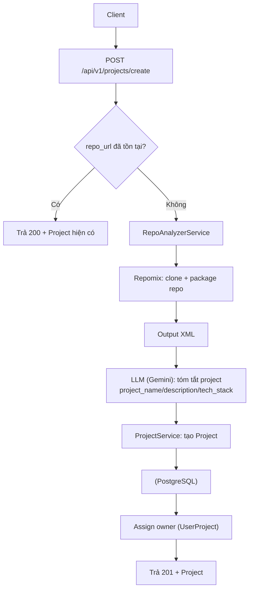
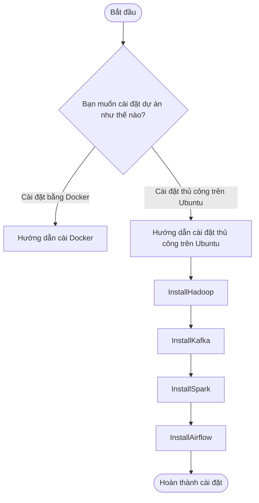

# Project Title

A brief description of what this project does and who it's for

## 🧩 Feature: Add Project API v1

### Overview
Thêm API tạo Project v1. Người dùng cung cấp `repo_url`, hệ thống dùng Repomix để đóng gói repo và LLM (Gemini) để tóm tắt dự án, sau đó lưu Project với `name/description/technologies/settings`. Tránh trùng theo `repo_url`.

### Solution
- RepoAnalyzerService
  - `run_repomix_remote(repo_url)`: chạy Repomix (ép UTF‑8, xử lý quirks Windows), sinh file XML.
  - `llm_summary_repo(path)`: gọi Gemini tóm tắt: `project_name`, `description`, `tech_stack`.
- ProjectService
  - `create_project()`: kiểm tra `repo_url` trùng; gọi analyzer; fallback `name` từ LLM nếu client để trống; gán owner từ header `X-User-ID`.
- Router
  - `POST /api/v1/projects/create`: trả Project (201). Nếu `repo_url` đã tồn tại → trả 200 + Project hiện có.

### How It Works








### Changes
- Routes: `POST /api/v1/projects/create`
- Service: `ProjectService.create_project`
- Analyzer: `RepoAnalyzerService` (repomix + LLM)
- Schemas: `CreateProjectRequest` (chuẩn hoá `name`/`repo_url`)
- Config/requirements: phục vụ repomix + LLM

### Screenshots

- [Đính kèm ảnh Swagger 201 Created]
- [Đính kèm ảnh case “Project đã tồn tại” (200)]
- (Tuỳ chọn) Ảnh log/flow

### Test Instructions
- Swagger: `POST /api/v1/projects/create`
- Curl:
  ```bash
  curl -X POST "http://localhost:8000/api/v1/projects/create" \
    -H "Content-Type: application/json" \
    -H "X-User-ID: 12345678-1234-5678-9012-123456789012" \
    -d '{"name":"","repo_url":"https://github.com/<owner>/<repo>.git","settings":{}}'
  ```
- Kỳ vọng: 201 + Project; gọi lại cùng `repo_url` → 200 + Project hiện có.
